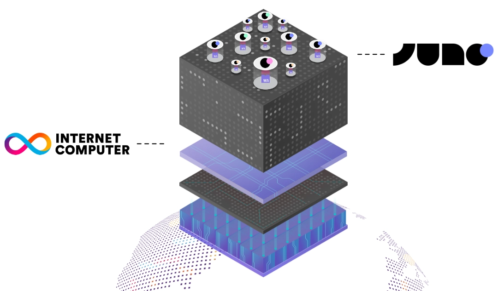

# Internet Computer

Juno operates on the [Internet Computer] (ICP or IC), a blockchain unlike any other.

The Internet Computer is like adding a super-powered, self-running cloud to the regular internet. It enables the creation of various systems and services on a decentralized network using "canister software", which represents a more advanced version of smart contracts.

The IC comprises a set of protocols that facilitate independent data centers worldwide in coming together to offer a decentralized alternative to the current centralized internet cloud providers, often referred to as Big Tech.

These independent entities operate specialized "node machines" to generate the same number of blocks as other machines within their network, ensuring uniformity through a Proof-of-Useful-Work (PoUW) mechanism. Their tasks involve replicating smart contract computations for optimal efficiency.

Thanks to its innovative architecture, protocols, and cutting-edge cryptography, the Internet Computer stands out as the fastest blockchain, capable of directly delivering web content from smart contracts.

This breakthrough enables 100% of online services to function on the blockchain, delivering complete decentralization and cost-effectiveness.

It is estimated that storing 1 GB of data inside a smart contract should cost approximately $5 USD per year, making the Internet Computer a transformative technology with remarkable potential for the digital world.

## Resources

- [Internet Computer]
- [Capabilities](https://internetcomputer.org/features)
- [How does it work](https://internetcomputer.org/how-it-works)
- [Computation and storage costs](https://internetcomputer.org/docs/current/developer-docs/gas-cost)

[Internet Computer]: https://internetcomputer.org/
